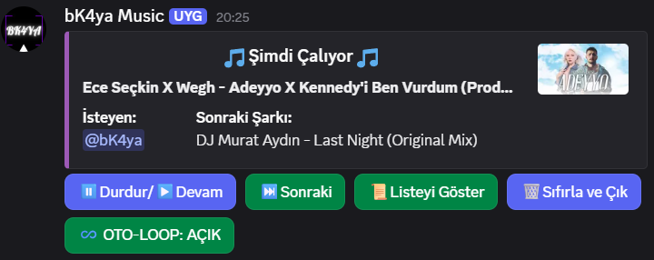
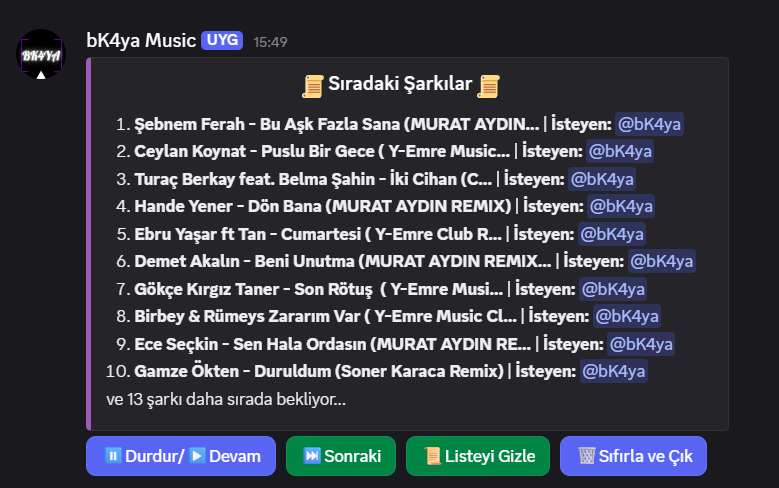

# 🎵 Discord Sunucunuz İçin YouTube Müzik Botu 🎵


Modern, interaktif UI butonlarına sahip ve YouTube üzerinden yüksek kaliteli ses akışı sağlayan gelişmiş bir Discord müzik botu.

Bu bot, sunucunuzdaki ses kanallarında mesaj kalabalığı yaratmadan, dinamik arayüzü sayesinde youtube linklerinde müzik deneyimini en kolay hale getirmek için tasarlanmıştır.

### Müzik Botunun UI Görünümleri



---

## Özellikler

*   **YouTube Desteği:** `.play <youtube-linki>` komutu ile doğrudan YouTube üzerinden şarkı oynatma.
*   **Playlist Desteği** `.playlist <playlist-linki>` komutu ile YouTube playlisti üzerinden toplu şarkı oynatma.
*   **İnteraktif UI Kontrolleri:** Şarkı oynatılırken kanaldaki interaktif butonlar sayesinde:
    *   ⏸️/▶️ Şarkıyı duraklatma ve devam ettirme.
    *   📋 Sıradaki şarkıların listesini dinamik olarak gösterme/gizleme (Gelişmiş Kuyruk Görünümü).
    *   ⏹️ Kuyruğu tamamen sıfırlayıp botun kanaldan ayrılmasını sağlayan hızlı kapatma butonu.
*   **"Sırada Ne Var?" Önizlemesi:** Liste butonuna basmanıza gerek kalmadan, bir sonraki şarkının başlığını doğrudan ana arayüz üzerinde görebilme kolaylığı.
*   **Temiz Sohbet Modu (Anti-Spam):** Bot, şarkı geçişlerinde veya kanaldan ayrıldığında eski mesajlarını ve artık işlevsiz kalan butonları otomatik olarak temizler. Sohbet akışını bozmaz, etkileşimi hep en altta tutar.

---

## 🛠️ Kurulum ve Çalıştırma 🛠️

Botu kendi sunucunuzda çalıştırmak için aşağıdaki adımları takip edin:

### 1. Gereksinimler
Sisteminizde **Python 3.12+** ve ses işleme için **FFmpeg** kurulu olmalıdır. Ayrıca FFmpeg Pathinizin sistem değişkenlerinde olduğundan emin olunuz.

### 2. Projeyi Klonlayın
```bash
git clone https://github.com/BerkayyKaya/Discord-Music-Bot
```

Proje dizinine geçin:
```bash
cd Discord-Music-Bot
```

### 3. Sanal Bir Ortam Oluşturarak Bağımlılıkları Yükleyin
```bash
python -m venv music_bot
```

Ortamı etkinleştirin:
```bash
.\music_bot\Scripts\activate
```

Bağımlılıkları yükleyin:
```bash
pip install -r requirements.txt
```

### 4. Bir Bot Oluşturun
#### [Discord Developer Portal](https://discord.com/developers/home) üzerinden yeni bir uygulama oluşturun:
- Developer Portalda 'Uygulamalar' bölümüne girin.
- Sağ üst köşedeki 'Yeni Uygulama' butonuna tıklayın ve botunuza bir isim verin.
- Oluşturduğunuz botun 'Bot' sekmesine girerek 'Token' bölümünün altında bulunan 'Tokeni Sıfırla' butonuna basarak yeni bir bot tokeni alın ve bu tokeni saklayın.

### 5. Bot Konfigürasyonunu Yapın
- Proje dizini içerisinde bir '.env' dosyası oluşturun.
- Dosyanın içeriğini aşağıdaki şekilde yazın:
```bash
discord_token = Buraya Bir Önceki Adımda Aldığınız Tokeni Yapıştırın
```

### 6. Botu Başlatın
- music_bot ortamınız aktifken proje dizini içerisinde aşağıdaki komutu çalıştırın.
```bash
python main.py
```

- Bunu yaptıktan sonra çıktı olarak aşağıdaki çıktıyı aldığınızda botunuz artık hazır demektir.
```bash
[System] Bot logged in with username -> "Botunuzun İsmi"
```
---

## Komutlar ve Kullanım

Botun varsayılan ön eki `.` olarak ayarlanmıştır. Komutları ve işlevlerini aşağıdaki tabloda bulabilirsiniz:

| Komut | Kullanım | Açıklama |
| :--- | :--- | :--- |
| **`.play`** | `.play <youtube-linki veya şarkı sözleri>` | Belirtilen tekil YouTube videosunu/şarkısını kuyruğa ekler ve oynatır. |
| **`.playlist`** | `.playlist <playlist-linki>` | YouTube oynatma listesindeki maksimum 25 şarkıyı rastgele olarak sıraya alır. |
| **`.liste`** | `.liste` | Sıradaki şarkıların güncel listesini ve kuyruk sırasını gösterir. |
| **`.shuffle`** | `.shuffle` | Aktif çalma listesini rastgele karıştırır. |
| **`.skip`** | `.skip` | O an çalan aktif müziği durdurur ve sıradakine geçer. |
| **`.pause`**  | `.pause`| Botun çaldığı aktif sesi durdurur. |
| **`.resume`** | `.resume` | Durdurulan sesi devam ettirir. |
| **`.clear`** | `.clear` | Aktif çalma listesini temizler. |
| **`.leave`** | `.leave` | Botu ses kanalından çıkarır, kuyruğu temizler ve aktif UI mesajını siler. |


> 💡 **Önemli Not:** Şarkı çalmaya başladıktan sonra sürekli komut yazmanıza gerek yoktur; durdurma, oynatma, listeyi açma/kapama ve kanaldan çıkarma işlemlerini doğrudan mesajın altındaki **İnteraktif UI Butonlarını** kullanarak çok daha hızlı yapabilirsiniz.
